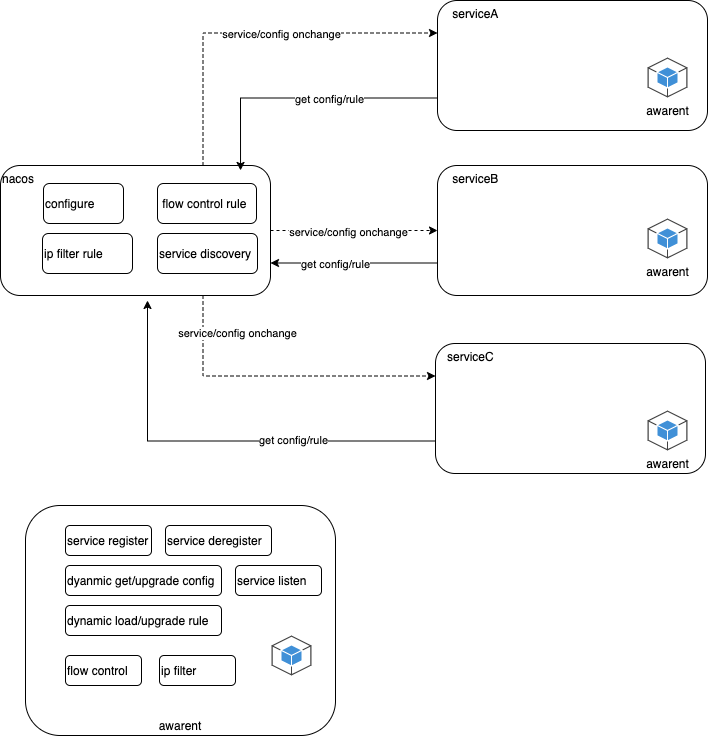

# du_aware_demon
 1. flowcontrol 
 2. ipfilter 
 3. service register/deregister
 4. configure dynamic get/upgrade
 5. dynamic upgrade flowcontrol/ipfilter rule
 6.  service client side load balance


# 架构



### config.yaml
- 场景一（id 映射）
```yaml
resource-param: cid # cid需要从url参数中获取的需要配置，cid在url路径中直接带的，⚠️不需要配置
flow-control-rules:
  - resource: bigdata
    threshold: 100
  - resource: test
    threshold: 50
  - resource: ads
    threshold: 1000
ip-filter-rules:
  allowed:
    - 127.0.0.1
    - localhost
    - 172.17.130.223
  blocked:
    - 10.10.1.21
    - 192.168.1.24
  urlPath: /q
  urlParam: cid # cid需要从url参数中获取的需要配置，cid在url路径中直接带的，⚠️不需要配置
  blockedDefault: false
  authorized:
    - resource: "test"
      ips:
        - 127.0.0.1
        - localhost
        - 172.17.130.223
    - resource: "bigdata"
      ips:
        - 127.0.0.1
        - localhost
        - 172.17.130.223
```
- 场景二（设备活跃）
```yaml
resource-param:  # cid需要从url参数中获取的需要配置，cid在url路径中直接带的，⚠️不需要配置
flow-control-rules:
  - resource: bigdata
    threshold: 100
  - resource: test
    threshold: 50
  - resource: ads
    threshold: 1000
ip-filter-rules:
  allowed:
    - 127.0.0.1
    - localhost
    - 172.17.130.223
  blocked:
    - 10.10.1.21
    - 192.168.1.24
  urlPath: /active
  urlParam:  # cid需要从url参数中获取的需要配置，cid在url路径中直接带的，⚠️不需要配置
  blockedDefault: false
  authorized:
    - resource: "test"
      ips:
        - 127.0.0.1
        - localhost
        - 172.17.130.223
    - resource: "bigdata"
      ips:
        - 127.0.0.1
        - localhost
        - 172.17.130.223
```


### init awarent
 

	ServiceName: 服务名字 

	Port： 服务端口 
  
	Nacos： nacos配置 包括 IP，Port 
  
	Group： 组，服务所在组 例如 DDV_TEST,DDV_DEV,DDV_PROD 
  
	ConfigID: nasco 配置 dataid 
  
	RuleID： IP Filter， 流量控制规则ID 


```
	aware, err := awarent.InitAwarent(awarent.Config{
		ServiceName: "ddv",
		Port:        8080,
		Nacos: awarent.Nacos{
			IP:   "192.168.1.71",
			Port: 8848,
		},
		Group: "DDV_TEST",
		RuleID: "DDV_RULES",// 可选，如果RuleID为空 则 限流和IP过滤功能将不可用
	})
```


### gin 使用 awarent

```
    e := gin.New()
	e.Use(gin.Recovery())
	//gin 使用 IP过滤middleware
	e.Use(aware.IPFilter())
	//gin 使用 限流middleware
	e.Use(aware.Sentinel())
	//gin 使用prometheus监控 包含限流统计
	e.GET("/awarent", awarent.PromHandler)
	//获取配置  
	content, _ := aware.GetConfig("DDV_CONFIG")
	fmt.Printf("content:%s", content)
	//监听配置更新 动态配置
	aware.ConfigOnChange("DDV_CONFIG", func(data string) {
		fmt.Printf("config updated:%s\n", data)
	})
	e.GET("/q", handlers.GetDDV)
	srv := &http.Server{
		Addr:    "0.0.0.0:8080",
		Handler: e,
	}

	go func() {
		if err := srv.ListenAndServe(); err != nil {
			fmt.Printf("start server error:%v\n", err)
		}
	}()
	quit := make(chan os.Signal)
	signal.Notify(quit, syscall.SIGINT, syscall.SIGTERM, syscall.SIGKILL)
	<-quit
	//服务注销
	aware.Deregister()
```


### nacos docker-compose 安装

* Clone 项目 并且进入项目根目录

  ```powershell
  git clone https://github.com/paderlol/nacos-docker.git
  cd nacos-docker
  ```


* 单机mysql8 

  ```powershell
  docker-compose -f example/standalone-mysql-8.yaml up -d 
  ```
  

